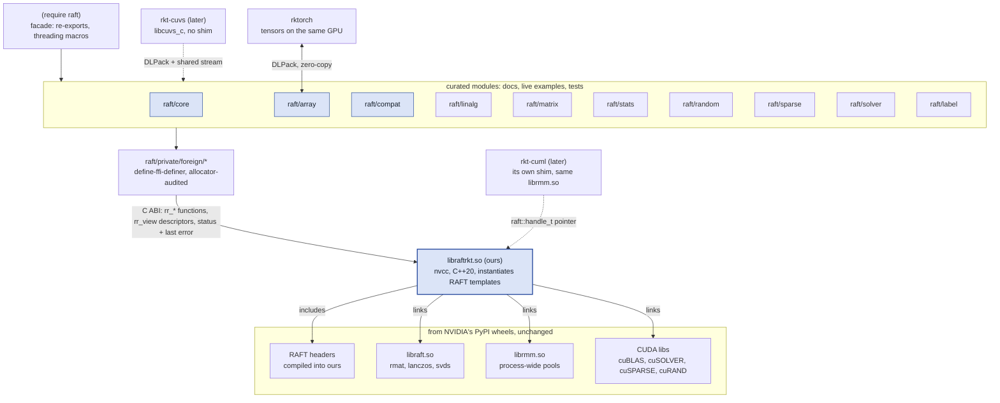
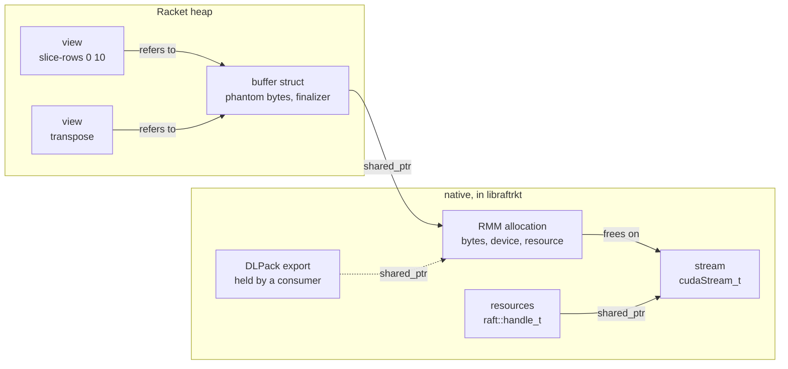

# RAFT for Racket: scoping plan

> Approved by the owner on 2026-10-01 (revision 5). Converted from the reviewed HTML page; the content is unchanged apart from the "Changes since approval" section below.

General-purpose Racket bindings to NVIDIA RAFT's device arrays and CUDA primitives, built to be the base a later cuML binding stands on. This plan scopes the project, designs `raft/core` and `raft/array` in detail, and lays out the legs.

| | |
|---|---|
| Upstream read | RAFT `release/26.10` at f3b5d0f; v26.08.00 wheels |
| Templates | rktorch (build, memory); rkt-polars (hand-curated shim, process) |
| First milestone | [Milestone 1: cuML-ready](#milestone-1-cuml-ready): legs 0 and 1, then cuML bindings begin |
| Host | RTX 3090 Ti, sm_86, 24 GB; driver 580.173 (CUDA 13.0) |
| Revisions | 2: FFI layer renamed `raft/private/foreign`; contracts deferred. 3: constructors named after their type; Python equivalents beside the Racket. 4: `raft/compat` conversions; a cuML-ready leg 1; clustering needs no cuVS. 5: M1 made the explicit first milestone, with exit criteria. |

## Changes since approval

- **Leg 1 is four stacked PRs.** It is split so each review is small: L1a `raft/core` (#3), L1b `raft/array` (#4), L1c `raft/compat` (#5), L1d downstream interface and k-means canary (#6). Epic: #1.
- **RAPIDS 26.08.** 26.10 was not on PyPI on 2026-10-01, so M1 pins 26.08; the bump is #7.
- **Follow-up issues for two decisions.** Decision 6, the shared array protocol with rktorch, is #8. Decision 4, the self-hosted GPU runner, is #9.
- **#10.** Leg 0 found that one memory pool across shims depends on the shims sharing RMM's symbols.
- **Tooling.** At the owner's request, leg 0 also adds the formatting and lint toolchain for Racket and C++; see AGENTS.md "Tooling".

## 1. The plan in brief

1.  **First priority: milestone M1, cuML-ready.** The plan is ordered to reach the point where cuML bindings can start. M1 is legs 0 and 1: the handle, device matrices and vectors, conversions from Racket data, and a frozen interface for a cuML shim. cuML's clustering entry points need nothing more, and they need no cuVS bindings, because cuVS stays hidden inside `libcuml`. After M1, cuML bindings and the rest of raft proceed in parallel ([milestone box below](#milestone-1-cuml-ready)).

2.  **Bind RAFT through our own C shim, written by hand like rkt-polars.** RAFT has no C API and no machine-readable op schema, so there is nothing to generate from. The shim (`libraftrkt`, prefix `rr_`) is CUDA C++ compiled with nvcc, because RAFT is header-only templates and we instantiate the kernels ourselves. Repetition is handled with dispatch macros and one op table per module, checked by scripts rather than produced by a generator.

3.  **Copy cuVS's C API conventions.** cuVS is the one RAPIDS library with an official C API, and its Rust, Go and Java bindings all sit on it: an opaque resources handle, an integer status with thread-local error text, and arrays passed as DLPack.

4.  **Correct the module list.** `raft/distance` and `raft/neighbors` no longer exist upstream. RAFT 26.02 moved distance, neighbors and clustering to cuVS, and a later cuVS binding can call cuVS's C API directly with no shim. Add `raft/matrix` (select_k, argmax, gather, slicing) and the small `raft/solver` and `raft/label`. PCA and TSVD moved into `raft/linalg` in 26.04.

5.  **Arrays are one owning buffer and many Racket views.** Only the native buffer (an RMM allocation) carries a finalizer and phantom bytes. Views, which play the role of RAFT's mdspan, are plain Racket structs holding shape, strides, offset, dtype and memory type, so slicing and transposing never cross the FFI. Arrays cross into the shim as a fixed-size descriptor. DLPack is the interchange format for rktorch, CuPy and cuVS.

6.  **Port rktorch's memory policy and add streams.** The ledger, phantom bytes, OOM classify-collect-retry and capacity backstop carry over. Three things are new. Frees are stream-ordered, so each native buffer holds a shared reference to its stream. The shim sets the device on every entry, so finalizers can run on any OS thread. Collections anchor at host-sync points, because there is no `backward!`.

7.  **The resources object is a `raft::handle_t`.** pylibraft constructs that type, and most of cuML's C++ API takes it (51 of 85 public headers), so a later cuML shim can use the same pointer. An exported ABI tag makes a version mismatch fail at load time.

8.  **pylibraft is thin, so CuPy is the main twin.** pylibraft only covers resources, streams, `device_ndarray`, rmat, eigsh and svds. Every other primitive is checked against CuPy on the same GPU, which uses the same cuBLAS and cuSOLVER, with NumPy, SciPy and scikit-learn as the semantic oracle. Twins are compared by machine.

9.  **Functionality and tests first, contracts later.** v1 ships no contracts and a single exception type. The shim still stops anything that would corrupt memory. Contracts get their own leg once core, array and the first primitive modules have settled.

10. **Linux and a GPU only.** There is no CPU fallback and no macOS. GitHub runners can compile and run the gates, but GPU tests, docs and the scoreboard need a self-hosted runner on the lab host ([decision 4](#14-decisions-for-you)).

### Milestone 1: cuML-ready

*Legs 0 and 1 · first priority.*

Reach the point where cuML bindings can be written against raft: a Racket program can build data, move it to the GPU, and hand raft's handle and arrays to a cuML shim that runs a clustering algorithm.

**In scope**

- Leg 0: repo, flake, RAPIDS wheels, nvcc shim, FFI layer, gates, CI and the GPU runner
- `device-resources`, `current-device-resources`, `resources-sync!`, `raft-version`, ABI tag
- the CUDA async memory resource as the default
- `device-matrix` and `device-vector`: float32, float64, int32, int64; row- and col-major; uninitialised outputs; `contiguous`
- `raft/compat` both ways: lists, vectors, nested forms, flvectors, `math/matrix`, `math/array`
- finalizers and phantom bytes on every buffer
- the frozen downstream interface and a k-means canary that exercises it

**Not before M1**

- the stream and event API
- pool, managed and statistics resources; workspace limit
- slicing and views; host, pinned and managed arrays
- DLPack and rktorch interop
- every primitive module: linalg, matrix, stats, random, sparse
- OOM retry, backstop and pressure tuning
- contracts

**Exit criteria**

1.  `nix flake check` is green on GitHub with every GPU case printing SKIP, and the full GPU suite is green on the lab runner.
2.  Conversions round-trip for lists, vectors, nested forms, flvectors and `math/matrix`, in all four dtypes and both layouts, and match their NumPy twins.
3.  `contiguous` turns row-major into col-major and back, matching NumPy.
4.  The k-means canary passes. It is a minimal cuML shim built against the raft flake's exported package set and headers. It takes raft's handle and arrays, runs `ML::kmeans::fit` and `predict` on `make_blobs` data, and agrees with `cuml.cluster.KMeans` on the same data: adjusted Rand index 1 between the label sets, and inertia within tolerance.
5.  1,000 repeated fits leave device memory flat, and the drop counters show every buffer freed.
6.  The downstream interface is written down and frozen: `rr_view`, `rr_resources_handle`, `rr_abi`, the three C++ headers and the Racket unsafe exports. Any later change bumps the ABI tag and the canary.

**What starts at M1**

Create rkt-cuml. Its first leg grows the canary into the k-means binding (fit, predict, fit_predict, transform), then follows the clustering order in [section 12](#12-starting-cuml-work). raft legs 2 to 5 and the primitive arcs continue alongside.

## 2. What RAFT is in October 2026

RAFT now lives at `github.com/NVIDIA/raft` and releases every two months (YY.MM). The latest tag is v26.08.00; `release/26.10` is cut and due in early October.

RAFT has shrunk. 26.02 removed neighbors, cluster, distance, spatial and the sparse distance and neighbors code, all now in cuVS. 26.04 moved PCA and TSVD in from cuML. Everything except a small `raft_runtime` (rmat, Lanczos, randomized SVD in `libraft.so`) is header-only templates, so whoever consumes RAFT compiles its kernels.

| Your module | Upstream on release/26.10 | Plan |
|----|----|----|
| `raft/core` | `core/` (85 headers): resources, device_resources, handle_t, streams, interruptible, operators; `mr/` memory resources | Keep legs 1–2 |
| `raft/array` | Lives in `core/`: mdspan, mdarray, mdbuffer; device, host, pinned and managed vector, matrix and scalar; row-major, col-major and strided layouts | Keep legs 1 and 3, as its own collection |
| `raft/linalg` | 41 headers: gemm, gemv, axpy, dot, eig, svd, rsvd, qr, lstsq, cholesky_r1_update, norm, normalize, reduce, map, unary/binary/ternary_op, matrix_vector_op, transpose, pca, tsvd | Keep |
| `raft/distance` | Removed in 26.02, now `cuvs::distance` | Drop to a later rkt-cuvs |
| `raft/neighbors` | Removed in 26.02, now `cuvs::neighbors` | Drop to a later rkt-cuvs |
| `raft/stats` | 27 headers: sum, mean, stddev, meanvar, cov, minmax, histogram, weighted_mean; metrics (accuracy, r2, ARI, mutual info, entropy, v-measure, silhouette, trustworthiness, KL divergence) | Keep |
| `raft/sparse` | convert, linalg (spmm, sddmm, laplacian, symmetrize), matrix (select_k), op, solver (lanczos, svds, mst) | Keep |
| `raft/random` | rng_state, distributions, make_blobs, make_regression, multi_variable_gaussian, permute, sample_without_replacement, rmat | Keep |
| none yet | `matrix/` (27): select_k, argmax/argmin, gather/scatter, slice, copy, diagonal, triangular, linewise_op, col_wise_sort, sample_rows | Add `raft/matrix` |
| none yet | `solver/` linear_assignment; `label/` classlabels, merge_labels | Add small |
| none yet | `comms/` (NCCL, UCX, MPI), single-node multi-GPU resources | Defer |
| none yet | `spectral/`: only cuGraph's modularity_maximization and partition remain | Defer |

#### The C++ API is still moving

26.06 and 26.08 moved memory resources to CCCL's `cuda::mr` design. 26.08 changed the layout of `raft::resources` (NVIDIA/raft#3052), and cuML had to rebuild against it. 26.10 changes streams from `rmm::cuda_stream_view` to `cuda::stream_ref` (NVIDIA/raft#3129). The plan pins exactly one release and gives every bump its own leg. The shim absorbs the churn so the Racket API does not move.

## 3. Architecture

Three Racket layers sit over one native library of ours, which sits over NVIDIA's libraries unchanged.



*Shaded: what leg 1 delivers, enough for cuML. Dashed: later packages in separate repos.*

Only `libraftrkt.so` is ours on the native side. Every RAFT kernel we expose is compiled into it. The libraries below it come from NVIDIA's wheels, and a later cuML shim must link the same `librmm.so` so that both see one memory pool. The shaded modules are what leg 1 delivers and what cuML work needs.

### Repository layout

One package, one collection (`raft`) and one manual, per the owner rule set in glmnet. The layout follows rktorch's, with rkt-polars' one-file-per-upstream-module split in the shim.

```text
rkt-raft/
  flake.nix  flake.lock  AGENTS.md  CLAUDE.md          ; CLAUDE.md points to AGENTS.md
  nix/rapids.nix                                    ; libraft, librmm, rapids-logger wheels; Python twins
  shim/
    CMakeLists.txt                                  ; find_package(raft) from the wheel; CUDA 20; arch knob
    include/raftrkt/c_api.h                         ; umbrella header, compiled as C in a test
    include/raftrkt/{core,array,linalg,matrix,stats,random,sparse}.h
    src/{core,array,linalg,matrix,stats,random,sparse}/*.cu
    src/{core,array,linalg,matrix,stats,random,sparse}/ops.def   ; what each module instantiates
    src/detail/{dispatch,view,error,buffer}.hpp
    tests/                                          ; gtest; GPU cases skip without a device
  raft/
    info.rkt  main.rkt
    core.rkt  array.rkt  compat.rkt  linalg.rkt  matrix.rkt  stats.rkt  random.rkt  sparse.rkt
    private/foreign/*.rkt                           ; FFI bindings, one per shim header
    private/{memory,pressure,dtype,error}.rkt
    scribblings/raft.scrbl                          ; guide + reference, one manual
    native-libs/                                    ; staged by nix: temp file + rename
  examples/{racket,python,test}/
  bench/                                            ; scoreboard, perf against CuPy
```

## 4. What is similar and what is different

The process, gates and owner rules carry over unchanged. The native side is new: RAFT is templates we compile ourselves, it allocates through RMM on streams, and nothing in it runs without a GPU.

| Aspect | rktorch | rkt-polars | RAFT plan |
|----|----|----|----|
| Where the surface comes from | native_functions.yaml through Python codegen (159 allowlisted ops) | Hand-written: 381 exports, with macro tables on both sides | Hand-written like rkt-polars: an op table per module, dispatch macros, census scripts; no generator |
| Native language | C++ shim over prebuilt libtorch | Rust cdylib over the polars crate | CUDA C++ through nvcc, C++20 |
| Where kernels come from | Precompiled in libtorch | Compiled from the crate | Instantiated in our shim for each dtype, layout and index type. Compile time and binary size are a budget. |
| Platforms | x86_64-linux and aarch64-darwin; CPU everywhere, CUDA and MPS optional | Linux and macOS | x86_64-linux only, GPU required |
| Allocator | Torch caching allocator, hidden | Rust heap, Arc | RMM memory resources: process-wide per device, pluggable (async, pool, managed), stream-ordered |
| Streams | None exposed; one stream | Not applicable | First-class. Every op queues on its resources' stream; reads to the host synchronize. |
| Array objects | One handle per tensor (at::Tensor refcount) | One handle per Series (cheap Arc clone) | One native buffer per allocation. Views are Racket values with no finalizer. |
| Outputs | Ops return new tensors | Ops return new handles | RAFT writes into caller-supplied output views. Racket allocates the output and offers `#:out`. |
| Python twin | PyTorch, same build as the shim | py-polars, run by hand | pylibraft where it exists, CuPy otherwise, NumPy/SciPy/scikit-learn as oracle; compared by machine |
| Racket layers | `foreign.rkt` facade over `foreign/raw` | `private/foreign.rkt`, monomorphic, then generic | Curated modules over `raft/private/foreign` |
| Contracts | At the definition site from v0 (`define/contract-out`) | `contract-out` on the generic layer | None in v1. One dedicated leg adds them once the API has settled. |
| Interop | Host copies only | Host copies; Arrow C interface open (bkc39/rkt-polars#119) | DLPack zero-copy from leg 4 |
| CI | Everything on GitHub; GPU parity self-skips | Everything on GitHub | GitHub compiles and gates; GPU tests need a lab runner |
| Memory pressure | Ledger, troughs at `backward!`, backstop, OOM retry | Finalizers only | Ledger, backstop, OOM retry. Trough anchors are measured in leg 5 before any are added. |
| Downstream users | None | glmnet reads columns | A cuML shim consumes the handle and buffers; an ABI tag guards versions |

### Carried over unchanged

- AGENTS.md is the canonical guide; usage docs go in Scribble, not source comments.
- FFI bindings in `raft/private/foreign`, one module per shim header, under the curated modules.
- `define-syntax-parse-rule` with syntax classes; `only-in` imports; modules of 500 lines or fewer.
- `with-*` forms over `dynamic-wind`, with the finalizer as backstop; no raw malloc/free.
- `->` for conversions, `in-*` sequences, short getters with long aliases.
- Typed OOM exception caught by type, with one retry.

- The allocator-audit test and drop counters exist before the first binding (bkc39/rkt-polars#92: 102 leaks).
- Symbols resolve at load time; a changed signature gets a new symbol; one table per fact.
- Native libraries staged by temp file and rename; `git add` before any nix command.
- The twin runs the same build as the shim; self-skips print SKIP.
- Every doc example is a test; one package, one manual.
- Arcs, legs, stacked PRs, review packets; every agent and bot finding addressed.

#### Deferred on purpose: contracts

v1 has no contracts. The curated modules use plain `provide`: no `define/contract-out`, no `define/checked-out`, no typed exception hierarchy and no hand-written argument validation in their place. We don't yet know the API well enough to declare it, so the early legs put their effort into functionality and tests. AGENTS.md states this explicitly, so agents used to rktorch and rkt-polars don't add contracts by habit.

Two things stay because the native side needs them. The shim turns every C++ exception into a status code, since an exception reaching Racket aborts the process. The shim also rejects any dtype, layout or output size it cannot handle safely, so a bad call raises an error instead of corrupting memory or crashing the test run. Contracts get [their own leg](#later-contracts-and-errors-size-m) once core, array and the first primitive modules have settled.

## 5. raft/core

Mirrors `pylibraft.common` and RMM's Python memory-resource API. Everything here is host-side bookkeeping; no kernels.

**Racket**

```racket
(require raft/core)

;; resources: pylibraft.common.DeviceResources
(define s   (cuda-stream))
(define res (device-resources #:stream s #:n-streams 4))
(resources-stream res)            ; the stream every op on res is queued on
(resources-device res)            ; 0
(resources-sync! res)             ; polls, so break works
(current-device-resources)        ; per-thread default, created lazily per device
(with-device-resources ([r (device-resources)])
  (rmat out theta 10 10 #:seed 12345 #:resources r))   ; destroyed on exit

;; streams and events: pylibraft.common.Stream
(define s2 (cuda-stream #:non-blocking? #t))
(stream-ready? s2)
(stream-sync! s2)
(stream-wait-event! s2 (stream-record-event! s))

;; devices
(device-count)                    ; 1
(device-properties 0)             ; name, compute capability 8.6, 24 GB
(with-device 0 body ...)

;; memory resources: rmm.mr
(set-current-device-resource!
 (cuda-async-memory-resource #:initial-pool-size (* 4 1024 1024 1024)))
(with-device-memory-resource (pool-memory-resource (cuda-memory-resource))
  body ...)
(memory-resource-statistics)      ; current, peak and total bytes
(set-resources-workspace-limit! res (* 512 1024 1024))

(raft-version)                    ; "26.10.00"
```

**Python** (pylibraft, rmm, CuPy)

```python
import cupy as cp
import rmm, rmm.statistics, pylibraft
from pylibraft.common import DeviceResources, Stream
from pylibraft.random import rmat

# resources
s   = Stream()
res = DeviceResources(stream=s, n_streams=4)
s                                 # no getter on DeviceResources; keep the Stream you passed
cp.cuda.runtime.getDevice()       # 0; DeviceResources does not record its device
res.sync()                        # blocks; Ctrl-C is honoured via cuda_interruptible
                                  # no default: handle=None makes a DeviceResources per call
r = DeviceResources()             # freed by refcount; there is no with-form
rmat(out, theta, 10, 10, seed=12345, handle=r)

# streams and events: pylibraft's Stream has no flags or events, so use CuPy's
s2 = cp.cuda.Stream(non_blocking=True)
s2.done
s2.synchronize()
e = cp.cuda.Event(); e.record(cp.cuda.ExternalStream(s.get_ptr()))
s2.wait_event(e)

# devices
cp.cuda.runtime.getDeviceCount()          # 1
cp.cuda.runtime.getDeviceProperties(0)    # dict: name, major, minor, totalGlobalMem
with cp.cuda.Device(0): ...

# memory resources
rmm.mr.set_current_device_resource(
    rmm.mr.CudaAsyncMemoryResource(initial_pool_size=4 * 1024**3))
prev = rmm.mr.get_current_device_resource()      # no with-form in RMM
pool = rmm.mr.PoolMemoryResource(rmm.mr.CudaMemoryResource())
rmm.mr.set_current_device_resource(pool)
try: ...
finally: rmm.mr.set_current_device_resource(prev)
rmm.statistics.enable_statistics()
rmm.statistics.get_statistics()           # current_bytes, peak_bytes, total_bytes, ...
                                          # no Python API for RAFT's workspace limit
pylibraft.__version__                     # "26.10.00"
```

### Decisions in core

- **The handle type.** The shim heap-allocates a `raft::handle_t` inside a `std::shared_ptr`. `handle_t` derives from `device_resources` and `resources` and adds no data members in 26.10. The same pointer therefore binds to cuML's `handle_t const&` and to every `raft::resources const&` API.
- **Default resources are per thread and per device.** This matches RAFT's `device_resources_manager` and cuML's thread-local handle. The default is stored in a thread cell rather than a parameter, so a new Racket thread never silently shares its parent's stream. Every op takes `#:resources`, the Racket form of pylibraft's `handle=`.
- **Ops are asynchronous; the host boundary synchronizes.** Ops queue and return. `->list`, `->flvector`, printing and `resources-sync!` synchronize. This departs from pylibraft's `auto_sync_handle`, which syncs after any call made without an explicit handle. We document the difference rather than copy it, because syncing after every call stalls the GPU's work queue.
- **Sync is a poll.** `stream-sync!` loops on `cudaStreamQuery` with backoff and yields to Racket between polls. That way `break` works, and the GC never waits behind a blocked FFI call (bkc39/rktorch#168 measured a 1.3 s GC stall on a plain `_fun`). RAFT's own internal syncs go through `raft::interruptible`; leg 2 checks that a Racket break can reach its cancel.
- **The device belongs to the object.** Resources and buffers record their device, and the shim calls `cudaSetDevice` from it on every entry. Nothing depends on which OS thread a Racket thread or finalizer happens to run on. `with-device` only sets the default for constructors.
- **Memory resources are process-wide per device.** This is RMM's model: the registry lives in `librmm.so`, so the pool raft sets also governs a later cuML. The default is CUDA's async resource (a `cudaMallocAsync` pool), because it can be trimmed after an OOM. RMM's pool resource cannot release memory while any allocation is live.
- **Errors, minimal for now.** The shim catches every C++ exception and returns a status, because an exception crossing into Racket aborts the process. Racket raises a single `exn:fail:raft` carrying RAFT's own message, read in the same atomic section as the call, as both earlier libraries do. The shim also tags out-of-memory failures, since the memory retry depends on that. Typed subtypes and friendlier messages wait for the [contracts leg](#later-contracts-and-errors-size-m).

&nbsp;

```c
/* shim/include/raftrkt/core.h (sketch) */
typedef struct rr_resources rr_resources;   /* std::shared_ptr<raft::handle_t> */
typedef struct rr_stream    rr_stream;      /* owned cudaStream_t, shared */
typedef struct rr_mr        rr_mr;          /* an RMM / CCCL memory resource */

/* status: 0 ok, 1 error (see rr_last_error), 2 buffer too small */
const char* rr_last_error(void);
int         rr_last_error_kind(void);       /* generic, oom, cuda, logic, interrupted */

int   rr_resources_create(int device, rr_stream* s, int n_streams, rr_resources** out);
void  rr_resources_free(rr_resources* r);
int   rr_resources_stream(rr_resources* r, rr_stream** out);
void* rr_resources_handle(rr_resources* r);  /* raft::handle_t*, for downstream shims */

int   rr_stream_create(int device, int non_blocking, rr_stream** out);
int   rr_stream_query(rr_stream* s, int* ready);
int   rr_mr_async_create(int device, size_t initial, size_t release_threshold, rr_mr** out);
int   rr_mr_set_current(int device, rr_mr* mr);
int   rr_mr_statistics(int device, rr_mem_stats* out);

const rr_abi_tag* rr_abi(void);  /* RAFT, RMM, CCCL versions; sizeof(handle_t); resource count */
```

## 6. raft/array

RAFT's array model is mdspan, a non-owning view, and mdarray, an owning container. The Racket model keeps that split but moves the views entirely into Racket.

| Concept | RAFT C++ | Racket |
|----|----|----|
| Element type | template parameter `T` | `dtype`: `'float32 'float64 'int8 'uint8 'int32 'uint32 'int64 'uint64`; half types later |
| Index type | `IdxT`, default `uint32_t` | Exact integers. The shim picks the `IdxT` each op is instantiated for and checks the range. |
| Layout | `layout_c_contiguous`, `layout_f_contiguous`, `layout_stride` | `'row-major`, `'col-major` or `'strided`, derived from the strides |
| Memory type | `memory_type` in the accessor: host, pinned, device, managed | `#:memory` `'device 'host 'pinned 'managed` |
| Owning container | `device_mdarray` from `make_device_matrix(res, r, c)` | `buffer`: one native RMM allocation, with a finalizer and phantom bytes |
| View | `device_matrix_view<T, IdxT, L>` | `array`: buffer, byte offset, shape, strides, dtype. Pure Racket, no finalizer. |

**Racket**

```racket
(require raft/array)

(define X (device-matrix 1000 128 #:dtype 'float32))   ; raft::make_device_matrix<float>
(define Y (device-matrix 1000 128 #:layout 'col-major))
(define v (list->device-vector '(1.0 2.0 3.0) #:dtype 'float64))
(define T (device-array '(8 32 32) #:dtype 'float32))  ; any rank: make_device_mdarray
(define H (pinned-matrix 1000 128))                    ; host, page-locked

X                          ; #<device-array float32[1000×128] row-major cuda:0>
(shape X)                  ; '(1000 128)
(strides X)                ; '(128 1), in elements

(define top (slice-rows X 0 10))     ; a view: same buffer, new offset, no FFI call
(define Xt  (transpose X))           ; a view: 128×1000 col-major over the same bytes
(contiguous Xt #:layout 'row-major)  ; copies only when it has to
(copy! H X)                          ; raft::copy, device to pinned host, async
(device-array->list v)               ; synchronizes; '(1.0 2.0 3.0)
(flvector->device-vector (flvector 1.0 2.0))
(for ([x (in-array v)]) ...)         ; one transfer, then host iteration

(gemm X W)                           ; allocates the output
(gemm X W #:out Z)                   ; writes into Z, like NumPy's out=
```

**Python** (pylibraft, CuPy)

```python
import numpy as np, cupy as cp, cupyx
from pylibraft.common import device_ndarray

X = device_ndarray.empty((1000, 128), dtype=np.float32)
Y = device_ndarray.empty((1000, 128), dtype=np.float32, order="F")
v = device_ndarray(np.array([1.0, 2.0, 3.0], dtype=np.float64))
T = device_ndarray.empty((8, 32, 32), dtype=np.float32)
H = cupyx.empty_pinned((1000, 128), dtype=np.float32)   # pylibraft has no pinned arrays

X                          # <pylibraft.common.device_ndarray.device_ndarray object at 0x…>
X.shape                    # (1000, 128)
X.strides                  # None when C-contiguous; otherwise bytes, (512, 4)

Xc  = cp.asarray(X)                  # zero-copy through __cuda_array_interface__
top = Xc[0:10]                       # device_ndarray cannot slice; CuPy can
Xt  = Xc.T
cp.ascontiguousarray(Xt)
Xc.get(out=H, blocking=False)       # device to pinned host
v.copy_to_host().tolist()            # [1.0, 2.0, 3.0]
device_ndarray(np.array([1.0, 2.0]))
for x in v.copy_to_host(): ...

Xc @ Wc                              # pylibraft has no gemm; CuPy calls cuBLAS
cp.matmul(Xc, Wc, out=Zc)
```

#### Where the two sides differ

- **pylibraft is not enough on its own.** It has no slicing, events, pinned arrays or gemm, so the Python side reaches for CuPy, as the twins will. A twin also routes CuPy through RMM (`cp.cuda.set_allocator(rmm.allocators.cupy.rmm_cupy_allocator)`) so both sides allocate from the same pool.
- **Strides.** Racket counts strides in elements, as RAFT, DLPack and PyTorch do. NumPy, CuPy and pylibraft count bytes, and pylibraft reports `None` for a C-contiguous array.
- **Default resources.** pylibraft creates a fresh handle for every call made without one and syncs before returning. Racket keeps one per thread and device and does not sync until a value reaches the host.
- **Scoped forms.** `with-device-resources` and `with-device-memory-resource` have no Python counterpart; Python relies on refcounting and a manual save and restore.
- **Constructors.** Racket names the type, `(device-matrix 1000 128)`. Python uses a class method, `device_ndarray.empty(shape)`; RAFT C++ uses a factory, `make_device_matrix`.

### Decisions in array

- **Views live in Racket.** Slicing, transposing and reshaping only build a new Racket struct; they never call the shim and never register a finalizer. A view keeps its buffer reachable, so RAFT's dangling-view hazard cannot arise from Racket. It also avoids the 3.6 to 6 µs finalizer registration rkt-polars measured per handle (bkc39/rkt-polars#150).
- **One allocation path.** Every buffer, including op outputs, is allocated by Racket calling `rr_buffer_alloc`. Ledger accounting, OOM retry and the allocator audit therefore cover a single path, and the shim never hands back memory it allocated on its own. The exception is workspace that RAFT allocates internally (see [memory](#7-memory-model)).
- **Outputs.** RAFT functions write into caller-supplied output views. Each Racket op allocates its output by default and takes `#:out` to reuse an existing array, mirroring NumPy's and CuPy's `out=`. For now the shim checks that `#:out` has the dtype and extents the op will write, because writing past a buffer that is too small corrupts memory instead of raising.
- **Layouts belong to the op.** Each op's entry in `ops.def` lists the layouts it is instantiated for; many RAFT primitives take only row-major, and some only col-major. For now an unsupported layout fails in the shim's dispatch with an error naming the op. The binding never copies silently. A contract that suggests `contiguous` comes with the contracts leg.
- **Dtype is one table.** The shim exports its dtype enum and its op table at run time, and `raft/private/dtype.rkt` reads them at load, with a test that round-trips every code. rktorch ended up with two dtype encodings; rkt-polars copied tag constants by hand (bkc39/rkt-polars#71).
- **Host arrays live off the Racket heap.** `'host` and `'pinned` arrays are allocated outside the GC (pinned through RMM's pinned resource). Device-to-host copies can then be `#:blocking?` without the GC moving their destination; rkt-polars learned that movable memory must never be blocking.
- **Names.** Constructors are named after their type, Racket style: `(device-matrix 1000 128)`, `(device-resources)`, `(cuda-async-memory-resource)`, with predicates such as `device-matrix?`. There are no `make-` factories. The stream constructor is `cuda-stream` because `racket/stream` already exports `stream`. pylibraft's `device_ndarray` becomes `device-ndarray` and `copy-to-host`, documented as aliases. The short getters `shape` and `dtype` collide with rktorch's exports; [decision 6](#14-decisions-for-you) proposes a shared protocol package.

### Conversions to and from Racket data: raft/compat

One module converts between device arrays and the data Racket programs already hold. Names follow `math/array`'s own conventions (`list*->array`, `array->vector*`), where a star means nested to any depth. It is the only module that requires `math-lib`, so `(require raft)` stays light.

| Racket value | To the GPU | Back to Racket |
|----|----|----|
| `math/matrix` matrix | `matrix->device-matrix` | `device-matrix->matrix` |
| `math/matrix` row or column matrix | `matrix->device-vector` | `device-vector->col-matrix`, `device-vector->row-matrix` |
| `math/array` array, any rank | `array->device-array` | `device-array->array` |
| Vector | `vector->device-vector` | `device-vector->vector` |
| Nested vectors | `vector*->device-matrix`, `vector*->device-array` | `device-array->vector*` |
| List | `list->device-vector` | `device-vector->list` |
| Nested lists | `list*->device-matrix`, `list*->device-array` | `device-array->list*` |
| `flvector`, `f32vector`, `f64vector`, bytes | `flvector->device-vector` and siblings | `device-vector->flvector` and siblings |

- **Element type.** Inferred as NumPy does: all exact integers give `'int64`, any other real gives `'float64`. `#:dtype` overrides it; `'float32` is the usual choice for cuML. Exact rationals become floats and complex numbers are rejected. Coming back, float arrays give flonums and integer arrays give exact integers.
- **Layout.** `#:layout 'col-major` packs the host buffer in column order, so no transpose runs on the GPU. Conversions back read any layout.
- **Shape.** Nested data must be rectangular; a ragged row raises an error that names the row.
- **Speed.** Lists and vectors are packed element by element into a buffer off the Racket heap, then copied to the device in one call. `flvector`, `f32vector`, `f64vector` and math's `FlArray` skip the packing: their storage goes to the device in one non-blocking FFI call, during which the GC cannot move it. `math/array` is Typed Racket, so each crossing from untyped code pays a contract; the module crosses once per array (`array->flarray`, `flarray-data`), never once per element.
- **Tests.** Round-trip property tests over random shapes, dtypes and layouts, plus a NumPy twin built with `np.asarray(nested, dtype=...)`.

**Racket**

```racket
(require math/matrix raft/compat)

(define A  (matrix [[1.0 2.0] [3.0 4.0]]))
(define dA (matrix->device-matrix A #:dtype 'float32))   ; 2×2 float32, row-major
(device-matrix->matrix dA)                                  ; (array #[#[1.0 2.0] #[3.0 4.0]])

(define dB (list*->device-matrix '((1 2 3) (4 5 6))))    ; int64, inferred
(device-array->list* dB)                                    ; '((1 2 3) (4 5 6))
(define dC (vector*->device-matrix #(#(1.0 2.0) #(3.0 4.0)) #:layout 'col-major))
(device-array->vector* dC)                                  ; '#(#(1.0 2.0) #(3.0 4.0))

(define dv (vector->device-vector #(0.5 1.5 2.5) #:dtype 'float32))
(device-vector->col-matrix dv)                              ; a 3×1 math/matrix
(flvector->device-vector (flvector 1.0 2.0 3.0))            ; one copy, no packing
```

**Python** (NumPy, pylibraft)

```python
import numpy as np
from pylibraft.common import device_ndarray

A  = np.array([[1.0, 2.0], [3.0, 4.0]])
dA = device_ndarray(A.astype(np.float32))
dA.copy_to_host()                             # array([[1., 2.], [3., 4.]], dtype=float32)

dB = device_ndarray(np.array([[1, 2, 3], [4, 5, 6]]))      # int64, inferred
dB.copy_to_host().tolist()                    # [[1, 2, 3], [4, 5, 6]]
dC = device_ndarray(np.asfortranarray([[1.0, 2.0], [3.0, 4.0]]))
dC.copy_to_host().tolist()                    # [[1.0, 2.0], [3.0, 4.0]]

dv = device_ndarray(np.array([0.5, 1.5, 2.5], dtype=np.float32))
dv.copy_to_host().reshape(-1, 1)              # a 3×1 column
device_ndarray(np.array([1.0, 2.0, 3.0]))
```

## 7. Memory model

Racket decides when an array is garbage. The native side decides when its bytes can be returned to the stream they were allocated on.



Views reach device memory only through their buffer. The native allocation is reference-counted, so whichever lets go last (the Racket finalizer, a DLPack consumer) triggers the free. Its stream is still alive at that point, whatever order Racket runs finalizers in.

| Mechanism | In rktorch | For RAFT |
|----|----|----|
| Phantom bytes | Per tensor, sized by the view, so shared views over-count | Per buffer, at the exact allocation size |
| Ledger | Per device, updated in an atomic section, never a semaphore | Same |
| Finalizer | Atomic, catches everything, counts failures | Same. The shim sets the device first, because finalizers run on any OS thread. |
| Out of memory | Classify, collect and wait, empty the cache, retry once | Classify `rmm::out_of_memory` and `cudaErrorMemoryAllocation`; collect and wait; trim the async pool (`cudaMemPoolTrimTo`); retry once |
| Backstop | Collect at 80% of capacity, with hysteresis | Same; live bytes are the larger of the ledger and RMM's statistics |
| Troughs | At the return of `backward!` and of the outermost layer call | There is no `backward!`. Candidate anchors are host syncs and the exit of `with-device-resources`; leg 5 measures before adding any. |
| Deterministic release | `tensor-free!` in the unsafe submodule | `with-device-arrays`, plus `array-free!` in the unsafe submodule |
| Hidden allocations | bkc39/rktorch#213 shadow phantom for allocator overhead | RAFT's workspace pool is invisible to the ledger; charge its limit as one phantom per resources object |

**Streams and frees.** RMM frees are stream-ordered. A buffer freed on stream A is safe for later work on A, but not for a kernel still reading it on stream B. The rule for v1 is that a buffer belongs to the stream it was allocated on. When an op uses the buffer from another resources object, it records an event on the buffer, and the free waits for that event; this is PyTorch's `record_stream`. Leg 3 specifies the rule and leg 5 tests it with a two-stream stress test.

## 8. Shim ABI and dispatch

The shim follows rktorch's C conventions and cuVS's argument conventions. Arrays enter as a fixed-size descriptor, so no pointer into the Racket heap crosses the boundary.

```c
/* shim/include/raftrkt/array.h (sketch) */
#define RR_MAX_RANK 8
typedef struct rr_view {
  void*   data;                    /* buffer base plus byte offset, already applied */
  int32_t dtype;                   /* rr_dtype, the one table Racket reads at load */
  int32_t memory;                  /* host, pinned, device, managed: raft::memory_type order */
  int32_t device;
  int32_t rank;
  int64_t shape[RR_MAX_RANK];
  int64_t strides[RR_MAX_RANK];    /* in elements */
} rr_view;

int rr_buffer_alloc(rr_resources* r, int memory, size_t bytes, rr_buffer** out);
void rr_buffer_free(rr_buffer* b);  /* finalizer target; sets device, frees on its stream */
int rr_copy(rr_resources* r, const rr_view* dst, const rr_view* src);
```

```cpp
// shim/src/linalg/gemm.cu (sketch)
extern "C" int rr_linalg_gemm(rr_resources* r, const rr_view* a, const rr_view* b,
                              const rr_view* out, double alpha, double beta) {
  return rr::translate_exceptions([&] {
    auto& res = rr::handle(r);           // sets the device, returns raft::handle_t&
    RR_DISPATCH_DTYPE(a->dtype, RR_FLOATS, T, {
      RR_DISPATCH_LAYOUT(*a, L, {
        raft::linalg::gemm(res, rr::matrix_view<const T, int64_t, L>(*a),
                                rr::matrix_view<const T, int64_t, L>(*b),
                                rr::matrix_view<T, int64_t, L>(*out),
                                rr::scalar<T>(alpha), rr::scalar<T>(beta));
      });
    });
  });
}

// shim/src/linalg/ops.def: the one list of what is instantiated
RR_OP(gemm,       RR_FLOATS,  RR_ROW | RR_COL)
RR_OP(gemv,       RR_FLOATS,  RR_ROW | RR_COL)
RR_OP(norm,       RR_FLOATS,  RR_ROW | RR_COL)
RR_OP(transpose,  RR_NUMERIC, RR_ROW | RR_COL)
```

### Tables and checkers instead of codegen

Each module's `ops.def` is the only statement of which dtypes and layouts an op supports. The shim compiles its dispatch from that file and also exports it at run time (`rr_op_table`), and Racket reads the same table at load time, so the contracts added later have one source to draw from. Three checkers keep the two sides honest:

- **Binding census.** Every `rr_` export has a Racket binding and the reverse, as rkt-polars' `check-bindings.rkt` does.
- **Allocator audit.** Every handle-returning binding has the allocator wrap, and no binding returns a bare `_pointer`.
- **Docs census.** Every public name has a `@defproc` with live examples and an example test.

### A fixed operator vocabulary

RAFT's `map`, `reduce`, `unary_op`, `binary_op`, `matrix_vector_op` and `linewise_op` are templated on device functors, and Racket closures cannot run on the GPU. The binding exposes the 31 named functors in `core/operators.hpp` as symbols: `add`, `sub`, `mul`, `div`, `sq`, `sqrt`, `abs`, `min`, `max`, `pow`, `argmin`, `argmax`, the comparisons and constants. A small set of compositions is instantiated as well, so `(map-then-reduce X #:map 'sq #:reduce 'add)` is a sum of squares. User-written device code (NVRTC) is out of scope for v1.

### Compile budget

nvcc compiles every op, dtype, layout and index-type combination once for each GPU architecture we target. Leg 0 measures one gemm and one reduce across float32/float64 and row/col to set the budget. Development builds target sm_86 only, this host's RTX 3090 Ti; release builds target RAPIDS' own list (75 through 120). Each module is its own set of translation units so they build in parallel, and they can become separate derivations if rebuild times hurt.

## 9. Parity, by example

"Parity with Python" needs a ladder, because pylibraft binds about 1% of RAFT's C++ surface.

| Rung | Reference | Covers | Tolerance |
|----|----|----|----|
| 1 | pylibraft, same libraft build | DeviceResources, Stream, device_ndarray, rmat, eigsh, svds | Bit-exact where deterministic |
| 2 | CuPy and cupyx.scipy, same GPU and same cuBLAS, cuSOLVER and cuSPARSE | Arrays, linalg, matrix, stats, sparse | Tight, in ulps |
| 3 | NumPy, SciPy, scikit-learn on the host | Semantics: ddof, singular-vector signs, eigenvalue order, metric definitions | Looser, after normalising sign and order |

- **Example triples, as in rktorch:** a literate `examples/racket/NN-*.rkt`, a `examples/python/NN_*.py` twin and a `examples/test/NN-*.rkt` runner. Inputs are generated in Racket and handed to the twin as `.npy` files, so the two sides never need matching random generators.
- **Compared by machine.** The test runs the twin, reads its JSON and compares within the rung's tolerance. rkt-polars twins are run by hand; we close that gap from leg 0.
- **Skips are reported.** With no GPU, or when `import cupy` fails, the test prints SKIP and the reason.
- **Every public name ships with** a `@defproc` whose examples run live and an example test. Following bkc39/rkt-polars#152, every doc example is also a `raco test` case.
- **The manual mirrors upstream.** The reference follows RAFT's C++ docs (core, memory, mdspan and mdarray, linear algebra, matrix, random, sparse, statistics, solvers). The guide mirrors pylibraft's and CuPy's user guides where they cover the same ground.
- **A scoreboard**, as in bkc39/rkt-polars#86: an end-to-end workload with PASS/FAIL checks and timing ratios against CuPy, strict at 1.2×, each check owned by an issue. The candidate is a GPU statistics notebook on a real dataset: load it through rkt-polars, standardize, take the covariance, run PCA/TSVD, select_k, a random projection, then a sparse graph Laplacian and an eigsh spectral embedding. Each step is checked against scikit-learn and SciPy ([decision 9](#14-decisions-for-you)).

## 10. Build and CI

- **Systems:** x86_64-linux. aarch64-linux (Grace) can come later, since wheels exist for it. There is no darwin target.
- **RAPIDS comes from wheels.** `nix/rapids.nix` fetches `libraft-cu13`, `librmm-cu13` and `rapids-logger` for one `rapidsVersion` with pinned hashes. It unpacks them and patches them with autoPatchelf against nixpkgs' `cudaPackages_13` (cuBLAS, cuSOLVER, cuSPARSE, cuRAND, nvJitLink). The wheels carry RAFT, RMM and CCCL headers plus CMake configs, so `find_package(raft)` works against the store path. This is the bkc39/rktorch#230 approach; nixpkgs has no RAPIDS packages at all.
- **nvcc.** nixpkgs has CUDA up to 13.2, while the 26.08 wheels were built with 13.3. Leg 0 checks that nvcc 13.2 compiles the wheel's CCCL. The fallback is an override from NVIDIA's redistributable manifest, as rktorch did for cuDNN 9.24. The host driver (580, CUDA 13.0) runs 13.x code through minor-version compatibility, provided we ship SASS for sm_86 rather than PTX that needs JIT.
- **Python twins:** `pylibraft-cu13`, `rmm-cu13`, `cupy-cuda13x`, numpy, scipy and scikit-learn from wheels, patched against the same CUDA libraries as the shim. An assertion checks that the twin's RAPIDS version equals the shim's.
- **Dev shell.** There is one GPU shell, since there is no CPU mode. It reuses rktorch's driver farm (`cudaHook` symlinks the host's libcuda, nvml and ptxjitcompiler). It also filters the host's CUDA 11.7 out of `LD_LIBRARY_PATH`, where it would otherwise shadow the nix libraries.
- **`nix flake check`** runs:
  - the shim build, plus a test that compiles the C headers as C
  - clang-format, clang-tidy and the line-count gate
  - the Racket build and `raco test`, with GPU cases self-skipping
  - the no-syntax-rule check
  - the binding census and the allocator audit
  - the dtype round trip
- **GitHub CI** runs the flake check and the Resyntax job, grepping for the `resyntax: .*\.rkt:N:N [` pattern. It has no GPU.
- **GPU CI.** A self-hosted runner on the lab host, labelled `gpu`, runs the GPU tests, the docs build, parity and the scoreboard for the owner's PRs, never for forks. The fallback is a pre-push GPU gate in the racket-dev plugin that commits a results bundle ([decision 4](#14-decisions-for-you)).
- **Distribution** is nix only for v1. The CUDA libraries are far too large to commit; rkt-polars already hit GitHub's 100 MiB file limit with polars alone.

## 11. Roadmap

Arc A is the foundation. Its legs 0 and 1 reach milestone M1, the first priority; legs 2 to 5 follow alongside the cuML work. Arc B is one arc per module, each leg covering one family of headers. Arc C lives in separate repositories. Sizes are relative: S, M, L.

### Arc A, part 1: milestone M1, cuML-ready (first priority)

Legs 0 and 1. The exit criteria are in the [milestone box](#milestone-1-cuml-ready).

**Leg 0** · size M

### Scaffold and the spinal cord

Repo, flake and RAPIDS wheels. An nvcc shim with `rr_last_error`, `rr_abi`, `rr_resources_create/free/sync`, `rr_buffer_alloc/free` and `rr_copy`. The FFI layer in `raft/private/foreign`, with the allocator audit and drop counters in place before the first binding. One example: a list becomes a device vector and comes back. Its twin is `device_ndarray(np.array(...)).copy_to_host()`. Gates, GitHub CI and the GPU runner. Measure nvcc time for gemm and reduce across float32/float64 and row/col.

Done when the flake check is green on GitHub with SKIP lines printed, and parity is green on the lab host.

**Leg 1** · size M

### cuML-ready core and arrays

Move the pin to 26.10 (`cuda::stream_ref`). Then deliver exactly what cuML work needs:

- `device-resources`, `current-device-resources`, `resources-sync!`, `raft-version` and the ABI tag
- the CUDA async memory resource, installed as the default on first use
- `device-matrix` and `device-vector` in float32, float64, int32 and int64, row- and col-major, including uninitialised outputs
- `shape`, `dtype`, `layout`, and `contiguous` for layout changes
- `raft/compat` in both directions
- finalizers and phantom bytes on every buffer
- the downstream interface: unsafe exports, C++ helper headers and the exported RAPIDS package set, now with `libcuml`
- the k-means canary: a minimal cuML shim that exercises that interface on the GPU runner

Done when M1's six exit criteria pass.

M1 · cuML-ready Reached when the exit criteria pass. rkt-cuml starts here and runs alongside everything below.

### Arc A, part 2: the rest of the foundation, alongside rkt-cuml

**Leg 2** · size M

### The rest of raft/core

- `cuda-stream` and events
- devices: `with-device`, `device-properties`
- pool, managed, cuda and statistics memory resources, and `with-device-memory-resource`
- workspace limit; polled sync and the interruptible cancel
- per-thread defaults

Write the Core chapter of the manual.

**Leg 3** · size L

### The rest of raft/array

- host, pinned and managed arrays; `device-array` of any rank and `device-scalar`
- views: slicing, transpose, reshape
- `copy!`, printing and `in-array`
- `#:out` outputs, with shim-side dtype, extent and layout checks
- growing the dispatch macros and `ops.def`
- the stream-ownership rule; OOM retry and the backstop

Write the Arrays chapter.

**Leg 4** · size M

### Interop

- **DLPack import and export** with stream handoff: version 0.8 for cuVS's C API, 1.x for PyTorch and CuPy.
- **rktorch exchange.** This needs `tensor->dlpack` and `dlpack->tensor` in rktorch, which ATen's `at::toDLPack` and `fromDLPack` provide; it is an rktorch issue to file.
- **rkt-polars host path.** `dataframe->f64vector` is already column-major.
- **Fixtures:** `.npy` read and write.
- **Output types:** `current-output-as`, like pylibraft's `set_output_as`.

**Leg 5** · size S–M

### Memory under pressure

Benchmarks for leaks, churn and two-stream frees. Decide the trough anchors and workspace accounting from measurements, and add finalizer diagnostics.

### Arc B: primitives

Ordered by what cuML includes most. Counting cuML's `#include`s by module: linalg 240, stats 63, sparse 53, label 15, random 14, matrix 13.

| Module | Header families | Twin |
|----|----|----|
| `raft/linalg` | BLAS-like (gemm, gemv, axpy, dot, transpose); elementwise, map and reduce over the operator vocabulary; norm and normalize; eig, svd, rsvd, qr, lstsq, cholesky_r1_update; PCA and TSVD | CuPy; scikit-learn PCA and TruncatedSVD |
| `raft/stats` | sum, mean, stddev, meanvar, cov, mean_center, minmax, weighted_mean, histogram; accuracy, r2, regression metrics, contingency matrix, ARI, rand index, entropy, mutual info, homogeneity, completeness, v-measure, KL divergence, information criterion, silhouette, trustworthiness | CuPy, scikit-learn, SciPy |
| `raft/matrix` | select_k, argmax/argmin, gather/scatter, slice, copy, diagonal, triangular, linewise_op, col_wise_sort, sample_rows, sign_flip, threshold, power, sqrt, ratio, reciprocal | CuPy |
| `raft/random` | rng_state, distributions, make_blobs, make_regression, multi_variable_gaussian, permute, sample_without_replacement, rmat | pylibraft rmat bit-exact; distributions by moments and KS tests |
| `raft/sparse` | CSR and COO types; dense/CSR/COO conversion; spmm, sddmm, masked_matmul, add, degree, laplacian, norm, symmetrize, transpose; diagonal, select_k; filter, reduce, row_op, slice, sort; lanczos eigsh, svds, mst | pylibraft.sparse.linalg, cupyx.scipy.sparse, SciPy |
| `raft/solver`, `raft/label` | linear_assignment; classlabels, merge_labels | SciPy linear_sum_assignment |

### Later: contracts and errors (size M)

Once `raft/array`, `raft/linalg` and `raft/stats` have been exercised by examples and the scoreboard, one leg adds the contract layer:

- `define/contract-out` in the curated modules, with `define/checked-out` for names other modules import (rktorch's split)
- typed exceptions: `:cuda`, `:out-of-memory`, `:interrupted` and `:logic`
- messages that name the verb the user called (bkc39/rkt-polars#102)
- shape, dtype and layout contracts on `#:out`, with suggestions such as `contiguous`
- deliberate `eval:error` doc examples, pinned by message

The contracts read dtype and layout facts from the same `ops.def` tables as the shim, so nothing is declared twice.

### Arc C: downstream, in separate repos

- **rkt-cuvs** calls `libcuvs_c`, cuVS's official C API, directly with no shim. It takes the modules dropped above (distance, neighbors, cluster) and receives raft arrays through DLPack.
- **rkt-cuml** is a cuML shim built on `raft/core`. It starts at M1, after leg 1, runs alongside raft legs 2 onward, and does clustering first ([next section](#12-starting-cuml-work)).

**Deferred:**

- comms and multi-GPU resources
- spectral
- padded layouts and half precision
- user-written device code
- `dry_run_resources`, which could later predict an op's peak memory for the ledger
- catalog distribution and aarch64-linux

## 12. Starting cuML work

The handle, device matrices and vectors, and conversions from Racket data are enough to start binding cuML's clustering algorithms. cuVS bindings are not needed.

**cuML hides cuVS.** cuML 26.10's public headers contain no cuVS types (NVIDIA/cuml#8342 removed them), `libcuml.so` links `libcuvs.so` privately, and cuML's Python package imports cuVS only in a test helper. k-means, DBSCAN, HDBSCAN and agglomerative clustering all run on cuVS inside `libcuml`, but a cuML shim never sees it. The nix package set only has to ship `libcuvs.so` for run time.

### What the clustering entry points take

| Algorithm | cuML C++ entry point | Arrays in and out | Other arguments, built by the cuML shim |
|----|----|----|----|
| k-means | `ML::kmeans::fit`, `predict`, `fit_predict`, `transform` | X n×d float32/float64 row-major; optional sample weights; centroids k×d out; labels int32 out | `KMeansParams`: n_clusters, init, max_iter, tol, n_init, and a seed held in a `raft::random::RngState` |
| DBSCAN | `ML::Dbscan::fit` | X float32/float64 row-major; labels int32 out; optional core-sample indices int32 out | eps, min_pts, metric (`ML::distance::DistanceType`) |
| Agglomerative | `ML::linkage::single_linkage` | X float32 row-major; children int32, 2×(n−1), out; labels int32 out | n_clusters, metric |
| HDBSCAN | `hdbscan` in `cluster/hdbscan.hpp` | X float32 row-major; eight outputs (labels, probabilities, children, sizes, deltas, MST source, destination and weights); core distances | `HDBSCANParams`, and an `hdbscan_output` object wrapping the outputs |
| Spectral clustering | `ML::SpectralClustering::fit_predict` | `raft::device_matrix_view<float, int, row_major>`; labels as `raft::device_vector_view<int, int>` | params. The only one built on `raft::resources` and RAFT views. |
| Test data | `ML::Datasets::make_blobs` | out float32/float64; labels int64 | n_clusters, cluster_std, row_major flag |

Everything except spectral clustering takes `const raft::handle_t&` plus raw pointers and counts. The parameter structs are plain C++ that the cuML shim fills from Racket keywords. That is why the handle and the array types are enough.

### What raft must provide first: milestone M1

**For Racket users**

- `device-resources`, `current-device-resources`, `resources-sync!`, `raft-version`
- the CUDA async memory resource, installed as the default on first use
- `device-matrix` and `device-vector` in float32, float64, int32 and int64, row- and col-major, including uninitialised outputs
- `shape`, `dtype`, `layout`, and `contiguous` for layout changes; k-means and DBSCAN want row-major
- `raft/compat` both ways: lists, vectors, nested forms, flvectors, `math/matrix`
- finalizers and phantom bytes on every buffer

**For the cuML binding**, frozen at the end of leg 1

- Racket unsafe exports: `resources->handle-pointer`; `array->view`, a pointer to a filled `rr_view` in non-moving memory; the status check that turns `rr_last_error` into `exn:fail:raft`
- C++ headers in the raft flake's dev output: `raftrkt/view.hpp` (an `rr_view` to a typed pointer with dtype, layout and extent checks, or to a `device_matrix_view`), `raftrkt/error.hpp` (`translate_exceptions` and the last-error slot), `raftrkt/abi.h`
- the RAPIDS package set exported by the raft flake, now including `libcuml` and `libcuvs`, so rkt-cuml builds against the identical derivation
- rkt-cuml allocates its outputs with raft's constructors, so cuML results are ordinary raft arrays with the same accounting

**Not needed before cuML work starts:**

- the stream and event API
- pool, managed and statistics resources; the workspace limit
- slicing and views; DLPack
- every primitive module (linalg, stats, matrix, random, sparse)
- memory-pressure tuning; contracts

### Order of work in rkt-cuml

1.  k-means: fit, predict, fit_predict and transform, with cuML's own `make_blobs` for data. Twins are `cuml.cluster.KMeans` and `sklearn.cluster.KMeans`.
2.  DBSCAN.
3.  Agglomerative clustering (single linkage).
4.  HDBSCAN, which has the most output arrays.
5.  Spectral clustering, which needs the view path (`rr_view` to `device_matrix_view`) and has a COO-graph variant.

Scores such as the adjusted Rand index come from cuML's own metrics header until `raft/stats` lands.

### Why bind cuML rather than write the algorithms on RAFT

RAFT's primitives could express a basic k-means: gemm for distances, argmin for assignment, `reduce_rows_by_key` for new centroids. That makes a good `raft/linalg` example. cuML's versions are tuned, though: k-means++ initialisation, batching, and fused distance kernels that now live in cuVS. Parity with `cuml.cluster` needs cuML's own code. Bind cuML for the algorithms, and keep the RAFT primitives for algorithms of your own.

### The ABI contract

cuML deleted its C API in April 2026 (NVIDIA/cuml#8011, shipped in 26.06), so rkt-cuml needs its own shim, which consumes what `raft/core` hands it. pylibraft and libcuml already work this way: pylibraft constructs the `handle_t` and libcuml uses it.

- **Handle.** `rr_resources_handle` returns the `raft::handle_t*`. Racket exposes it as `resources->handle-pointer` in the unsafe submodule.
- **Arrays.** cuML takes raw pointers and counts, and often wants column-major input (its OLS forces F-order). The cuML shim takes `rr_view` and validates dtype, layout and offset itself. `(contiguous X #:layout 'col-major)` produces the input it wants.
- **Versions move in lockstep.** RAFT has no versioned namespace, and its handle layout changed mid-cycle (NVIDIA/raft#3052). Both shims must compile against identical RAFT, RMM and CCCL headers. The raft flake exports its `rapids` package set and rkt-cuml takes it as an input, so there is one derivation.
- **ABI check at load.** `rr_abi()` reports the RAFT version, the RMM ABI namespace, the CCCL version, `sizeof(raft::handle_t)` and the resource-type count. The cuML shim compares them when it loads and refuses to run on a mismatch.
- **One memory pool.** Both shims link the same `librmm.so`, whose per-device registry is unique in the process, so a pool set from `raft/core` also governs cuML's allocations.
- **One RAPIDS per process.** The libraries' SONAMEs are unversioned, so only one copy of each can load. Keep `ffi-lib`'s default local binding.
- **Package versions.** Bump the raft package version on every new export so rkt-cuml can pin it (bkc39/rkt-polars#144).
- **rkt-cuvs** should share a stream and memory pool with raft rather than the handle, because `libcuvs_c` builds its own `raft::resources`. Passing our handle across is safe only with identical versions.

## 13. Risks

| Risk | Why it matters | Mitigation |
|----|----|----|
| Upstream C++ churn | Streams, memory resources and the handle layout all changed in 2026 | Pin one release; each bump is its own leg; the shim absorbs it |
| nvcc compile time and binary size | We compile every op, dtype, layout and architecture combination ourselves | Measure in leg 0; sm_86-only dev builds; per-module translation units; small dtype sets per op |
| No GPU on GitHub | Most tests cannot run in public CI | Lab runner; printed SKIPs; committed results bundles |
| Toolchain skew | nixpkgs nvcc 13.2 against wheels built with 13.3; driver at CUDA 13.0 | Check in leg 0; redistributable override; ship SASS for sm_86 |
| Host CUDA 11.7 on the library path | Shadows the nix cuBLAS (already hit in rktorch) | Filter it in the shell hook; verify with an `LD_BIND_NOW` dlopen |
| Cross-stream frees | Use after free when a buffer is still read on another stream | Stream-ownership rule with recorded events; two-stream stress test |
| Hidden syncs inside RAFT | Some primitives synchronize internally, and a long blocking FFI call stalls Racket's GC | Mark the known-syncing calls; route RAFT's syncs through interruptible |
| Parity semantics | CuPy, NumPy and RAFT differ on ddof, singular-vector sign and eigenvalue order | Per-op normalisation in the twin harness, documented in the reference |
| No contracts in v1 | Bad arguments surface as RAFT's C++ messages, and an unchecked case could compute the wrong answer | The shim checks what memory safety needs (dtype, layout, rank, output extents); tests and twins cover behaviour; the contracts leg follows |
| Functor-templated primitives | Racket code cannot run on the GPU | Named operator vocabulary; no NVRTC in v1 |

## 14. Decisions for you

Each has a recommendation. Leg 0 can start once 1 to 4 are settled, and decision 11 is needed during leg 1; the rest can wait until the leg they affect.

1.  **Repo and package name.** Recommendrepo `rkt-raft`, with one package and one collection named `raft`, matching rkt-polars and keeping to one manual.

2.  **RAPIDS pin.** Recommendbuilding leg 0 on the 26.08 wheels and moving to 26.10 at the start of leg 1, once it is tagged. 26.10 changes the stream type that the core API is built on.

3.  **CUDA major version.** Recommend13 only, which matches rktorch's cu130 and your 580 driver. Supporting 12 as well doubles the wheel and twin matrix.

4.  **GPU CI.** Recommenda self-hosted GitHub runner on the lab host, used only for your PRs. The alternative is a local pre-push GPU gate with committed results bundles.

5.  **Module list.** Do you accept dropping `raft/distance` and `raft/neighbors` (they go to a later rkt-cuvs) and adding `raft/matrix`, `raft/solver` and `raft/label`?

6.  **A shared array protocol.** rktorch already exports `shape`, `dtype` and `numel`, and raft wants the same names. Recommenda small shared package: the DLPack structs plus a generic interface for shape, dtype, device and `->dlpack`. rktorch, raft and later rkt-cuml would implement it, so `(require torch raft)` does not collide and interop is a single protocol. The alternative is that raft uses only long names such as `array-shape`.

7.  **Default memory resource.** RecommendCUDA's async resource, which can be trimmed after an OOM, over RMM's pool.

8.  **Sync policy.** Recommendasynchronous ops that synchronize at host reads, documented as a departure from pylibraft's `auto_sync_handle`.

9.  **Scoreboard workload.** Is the GPU statistics notebook (PCA, select_k and spectral embedding on a real dataset) the right acceptance test, or do you have a notebook in mind, as nycflights was for rkt-polars?

10. **CuPy as the main twin.** Is it OK to add `cupy-cuda13x` to the twin environment?

11. **Where the k-means canary lives.** Recommendraft's repo, under `downstream/kmeans-canary/`, run on the GPU runner only. It then guards the frozen interface on every raft change, at the cost of pulling `libcuml` into raft's GPU test closure. The alternative is to keep it only in rkt-cuml, which finds interface breaks one step later.

**Sources read:** RAFT `release/26.10` at f3b5d0f and the v26.08.00 wheels (`libraft-cu13`, `librmm-cu13`, `rapids-logger`); cuML `release/26.10` at 7daaa4d; cuVS `release/26.10` at 5d501a5; rktorch `origin/master` 9d1437f; rkt-polars `origin/master` 0aa75c3.

**Not yet verified:** that `ffi-lib` binds locally by default (believed so); that nixpkgs' nvcc 13.2 compiles the 13.3 wheels' CCCL; the 26.10 binaries, since only 26.08 wheels were inspected.
